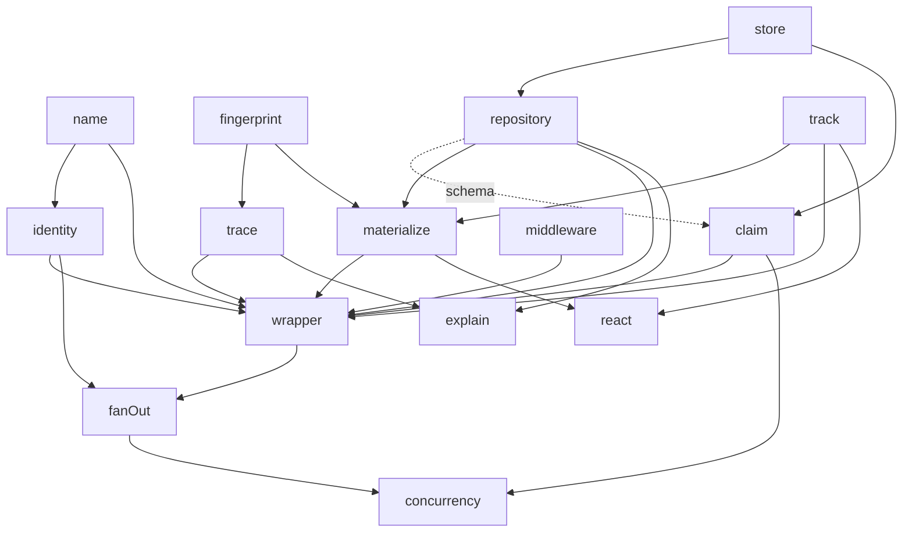

> Historical artifact. Superseded by the [active specification](../../../spec/README.md). Do not implement from this document.

# Internal components — candidates, responsibilities, dependencies

2026-09-12. Sits between `incremental-analysis-deep-design-rev9.md` and the spec. Rev 9 settles *what the library is*; this document proposes *what it is made of*, so the spec can be written per component and the implementing agent can build and test parts in isolation. Everything here is [candidate]: a cut is proposed, the reason for it is stated, and the spec may move a line — but not without saying which criterion below it failed.

---

## 1. The cut criterion

A component earns its boundary when both hold:

1. **It can be tested without the others.** Pure functions get unit tests over values; a component with a dependency gets tested against a fake of that dependency's interface, not against the real thing.
2. **A design change lands inside exactly one of them.** Rev 9's open questions are the test set for this: each should name one component (§7 checks).

A corollary that shaped several cuts: **a mechanism and a policy that uses it are two components** when the policy can vary per consumer and the mechanism cannot.

---

## 2. What is not a component

Naming these first prevents them from reappearing as modules.

- **Invalidation.** It does not run; it is a comparison of a recorded read set against current fingerprints. That comparison lives in *trace*. There is no invalidation engine.
- **The graph.** No component holds one. Entanglement builds a per-run dependency set (in *track*); the trace persists per-result read sets. Anything that materializes "the graph" as a structure is M0.
- **The scheduler.** The task is the arbiter of eligibility; a memoized wrapper runs when reached. Concurrency is a helper, not a core module.
- **Re-roll, TTL, freshness.** Inputs and counters an author builds. No module.
- **Retention and reclamation policy.** Parameters of *repository*, not a module.
- **Cost control.** User middleware in the gate region. Not core.
- **Pinned inputs.** Not a component: an identified, fingerprinted value, produced by *identity* + *fingerprint*, exposed through the *wrapper's* API.

---

## 3. Core components

Listed in dependency order — leaves first. For each: responsibility, explicit non-responsibilities, dependencies, and how it is tested alone.

### 3.1 `name` — leaf

**Owns:** deriving a step's name from a declared function or class; an explicit override; refusing to derive one where none exists. This is the seam where SC20 lives and where the bundler/minifier hazard is documented.
**Does not own:** whether a step is memoized; identity composition.
**Depends on:** nothing.
**Tested by:** functions, classes, arrows with and without inferred names, overrides. Pure.
**Why separate:** two consumers (identity paths, storage keys) with different failure severity — cosmetic on one side, orphaning on the other. The throw belongs to the memoized caller, not to `name`; `name` reports absence, the *wrapper* decides it is fatal.

### 3.2 `fingerprint` — leaf

**Owns:** content → fingerprint at two grains, value and field; canonicalization; equality. The stored fingerprint of a field is what a downstream compare reads without loading content.
**Does not own:** what to compare, when, or what the verdict means. No I/O.
**Depends on:** nothing.
**Tested by:** golden fingerprints; stability under key order; the two-grain relationship (a field change moves the value fingerprint; a value fingerprint identity implies all field fingerprints identical).
**OQ3 lands here** (granularity, in-memory boundary fingerprints).

### 3.3 `identity` — leaf

**Owns:** the identity function keyed to an output type; the derivation rule when none is declared (producing step's name + identities consumed; else identities consumed); composition as a bracketed path (a fan-out opens a bracket, a reducer closes it); the index hash over the structured path; the pinned-input case (identity assigned to a value with no producing step).
**Does not own:** fingerprints, storage, whether anything is memoized. Identity is the same for memoized and unmemoized producers — the axis rule is enforced by this component having no memoization input at all.
**Depends on:** `name` (for the derivation fallback).
**Tested by:** composition over nested brackets; two steps agreeing on one type's identity; the fallback rule; hash stability.
**OQ2 lands here**, jointly with `materialize` (whether a collection's identity participates in tracked reads).

### 3.4 `track` — leaf, likely adopted rather than written

**Owns:** revision tags, the autotrack frame, entanglement on read, in-process memoization of derivations. Process-local by construction; nothing here is ever persisted (SC21).
**Does not own:** fingerprints, identity, storage, cost.
**Depends on:** nothing.
**Tested by:** the library's own suite if adopted; otherwise the standard cases — a read entangles, a bump invalidates readers only, a frame yields its dependency set.
**OQ8 lands here** (whether in-process derivation caching earns its keep when CPU is free).
**Note:** rev 9 §2.7 keeps the tag half for the consumer boundary. If a signals or validator library is adopted, this component is a thin façade fixing the interface the rest of core depends on, so the adopted library is replaceable.

### 3.5 `middleware` — leaf

**Owns:** the pipeline mechanism only: a stack with reserved positions the library fills, user regions (*around*, *gate*), the rule that a middleware that does not call next is a stop, and the ordering guarantee that *gate* sits after *verify*. A pure composition runner.
**Does not own:** any actual middleware. Verify, gate, claim, execute, write, release are functions supplied by the *wrapper*, bound to other components.
**Depends on:** nothing.
**Tested by:** ordering, visibility of built-ins, immovability, a stop short-circuiting, region placement.
**Why separate from the wrapper:** the stack's invariants are independent of what runs in it, and a consumer's middleware is tested against this alone.

### 3.6 `store` — leaf, the demanding one

**Owns:** rows in, rows out; batch read; a **compare-and-set on a single row**; a query for rows whose lease has expired; whatever transaction/row-locking the backend provides, surfaced as those two operations. Default backend: SQLite, in core.
**Does not own:** the shape of a result, generations, lifecycle semantics, lease meaning. It stores what it is given.
**Depends on:** nothing.
**Tested by:** a conformance suite any backend must pass — and the CAS is the qualifying test. A backend that cannot do a row-level compare-and-set does not qualify, regardless of read/write performance.
**Sequencing note:** this leaf's hardest requirement comes from *claim*, not from reads and writes. Design the interface with CAS first; do not add locking later.
**OQ4 lands partly here** (SQLite contention; notify vs poll is shared with `claim`).

### 3.7 `trace` — on `fingerprint`

**Owns:** the record format for a read set (address + fingerprint at the grain read); collecting reads during an execution; **verifying** a stored read set against current fingerprints and returning a verdict *with the first divergence*, so explanation is free; the rule that a miss in the recorded set is never a change.
**Does not own:** deciding what to do with the verdict; storage; the tracking frame itself (reads arrive as data from *materialize*, via the frame the *wrapper* installs).
**Depends on:** `fingerprint`.
**Tested by:** verify over synthetic read sets; divergence reporting; the miss rule; two-grain compare (value fingerprint short-circuits field compares).
**Why this is "invalidation":** the whole cross-process invalidation system is this verify function. Keeping it pure means it never touches a row and can be exercised with no store.

### 3.8 `repository` — on `store`

**Owns:** the result row schema; the candidate key (step name, revision, subject); generations — current, superseded, retained history; reading a result by key at either grain; writing a new generation; retention and reclamation as *parameters*; recorded cost and arrival path on the row.
**Does not own:** the lifecycle transitions of a claim (see `claim`), even though claim state is a column on this row. It owns the schema; `claim` owns the transitions.
**Depends on:** `store`.
**Tested by:** against a fake store — supersession, retention, key lookup, both grains.
**OQ5 lands here** (reclamation for cheap results; the viewer's session slices).
**Coupling flagged:** `repository` and `claim` share a row. The schema is owned here; `claim` writes only its status/lease/progress columns via CAS. This is the one place two components touch one structure, and it is accepted because Mike's decision that the claim is a state on the result row — the database's own row lock as the mutex — is what removes a coordination service.

### 3.9 `claim` — on `store` (and `repository`'s schema)

**Owns:** the lifecycle `claimed → current → superseded` and `claimed → abandoned` on the candidate key; lease expiry; **extend, which requires a progress value and rejects one identical to the last**; the periodic sweep; **waiting on a claim** — the path a converging worker and a viewer user share.
**Does not own:** retry; reconciling lost provider calls; any execution; a timer that renews leases (graveyard).
**Depends on:** `store` for CAS and the expired-lease query; the row schema from `repository` at the type level only.
**Tested by:** against a fake store with CAS — race two claimants, expire a lease, reject a duplicate progress value, sweep, abandon, wait-then-serve.
**OQ7 lands here** (lease parameters). **OQ4 lands partly here** (poll vs notify for the waiter).
**Why separate from `repository`:** lease and progress semantics are meaty and independent of generation semantics; a change in one should not open the other.

### 3.10 `materialize` — on `repository`, `fingerprint`, `track`

**Owns:** the storage-backed value: an ES proxy over a result; field access recorded as a read at field grain; weak caching of field values; the read set from the first run used as a **prefetch prediction, not a contract**; the **prefetch loader** — partitioning a read set into resolved, in flight, unrequested; batching the third; one completion. Reads are entangled through `track` and reported (address, fingerprint) into the current frame for `trace` to collect.
**Does not own:** a mode. Expensive-and-small and cheap-and-enormous go through the same abstraction; nothing here is author-selected.
**Depends on:** `repository` (fetch), `fingerprint` (compare stored vs loaded), `track` (entangle).
**Tested by:** proxy behavior over a fake repository — lazy load, weak cache, read recording, prefetch partitioning, batch coalescing.
**OQ1 lands here** (proxy leaks). **OQ2 shared with `identity`.**
**Note:** the prefetch loader is the same shape the viewer's client needs over a wire (viewer sketch §5). Keep it transport-agnostic inside `materialize` so the adapter package reuses it rather than reimplementing it.

### 3.11 `wrapper` — the assembly point, on everything above

**Owns:** the author-facing API — declaring a step, memoizing one, creating a pinned input; instantiating the library middleware (verify, gate, claim, execute, write, release) bound to `trace`, `claim`, `repository`, `track`; installing the tracking frame per execution; the throw when memoizing something `name` cannot name; the **seam** where a served result re-enters the process as a storage-backed value with fresh tags.
**Does not own:** logic. Every rule it applies belongs to one of the components it composes. If the wrapper grows a rule of its own, that rule is misplaced.
**Depends on:** all of the above.
**Tested by:** integration — the steel threads. This is the only component whose tests are end-to-end by nature, which is the reason it must contain nothing but composition.

### 3.12 `explain` — on `repository`, `trace`; nothing depends on it

**Owns:** read-side queries over stored data: why did this run; why did it *not* run; what changed and from what (the divergence `trace` recorded); a subject's generations; **obviation pricing** — what a change would obviate, priced at recorded cost. Also the runtime observer face: the "consider memoizing" tracing nudge, installed as an around middleware.
**Does not own:** any write. Pure reads over `repository` and the `trace` record format.
**Depends on:** `repository`, `trace`.
**Tested by:** queries over a seeded repository.
**OQ6 lands here** (tracing thresholds).
**Placement:** core, because explainability is a standing constraint and this is the only module that turns stored data into "why." Built last; nothing waits on it.

---

## 4. Helpers package

Same criterion; these depend on core's public surface, never on its internals.

### 4.1 `fanOut` / `fanIn`

**Owns:** opening and closing an identity bracket; member-grain tracking over a collection; a reducer that closes the bracket. Ships first among helpers.
**Depends on:** `identity` (brackets), `track`, `wrapper` (members are steps).
**Design-pattern material** (relative positioning, partial re-evaluation hazards) is documentation attached here, not code.

### 4.2 `concurrency` — the default worker policy

**Owns:** a pool with a shared queue; the unit of work is a member's subtree; permits guarding the actual fetches; the partition hint as a locality hint; work stealing as a late pressure valve. Fixed policy now, measured, then adapted.
**Depends on:** `fanOut`/`fanIn` (the worker boundary), `claim` (convergence across workers).
**Does not own:** any concept core lacks. Whether it is needed at all is decided by ST11.

---

## 5. Adapter package (viewer-side)

`react` — the `useSyncExternalStore`-style bridge: run a render's reads in a tracking frame, subscribe to the resulting subjects, notify on movement, present request-like state. Depends on `track` and `materialize`'s loader, plus a client routing table and stream that belong to the viewer, not to this library. Neither core nor helpers.

---

## 6. Dependency graph

**Leaves (no dependencies):** `name`, `fingerprint`, `identity`*, `track`, `middleware`, `store`. (*`identity` depends only on `name`, which is trivial; treat both as one leaf for sequencing.)

**Everything hard is in a leaf.** CAS in `store`; the two-grain compare in `fingerprint`; bracket composition in `identity`; entanglement in `track`. The layers above are thin logic over those, and the wrapper is nothing but composition.

---

## 7. Check: do the open questions each land in one component?

| OQ | Lands in |
|---|---|
| OQ1 proxy leaks | `materialize` |
| OQ2 collection identity in tracking | `identity` + `materialize` — the one straddle |
| OQ3 fingerprint granularity | `fingerprint` |
| OQ4 cross-process store | `store` (contention) + `claim` (poll vs notify) — one question that was really two |
| OQ5 reclamation | `repository` |
| OQ6 tracing thresholds | `explain` |
| OQ7 lease parameters | `claim` |
| OQ8 in-process derivation cache | `track` |

OQ4 splitting cleanly is evidence for the `store`/`claim` cut. OQ2 straddling is a signal to resolve it early, before either component's interface freezes.

---

## 8. Sequencing

Derived from the graph, not from importance.

1. **Leaves, in parallel:** `name`, `fingerprint`, `identity`, `middleware`; adopt or façade `track`; `store` with its conformance suite and **CAS first**.
2. **Second layer:** `trace`, `repository`, `claim` — each against a fake of its single dependency.
3. **Third layer:** `materialize`, then `wrapper`. The steel threads become runnable here; ST0–ST3 should pass before anything in step 4.
4. **`explain`.**
5. **Helpers:** `fanOut`/`fanIn`; then, only if ST11 says so, `concurrency`.
6. **Adapter:** when the viewer exists.

Two things this order guarantees: no component is built against a real dependency it could have faked, and the assembly point is written last, when it has nothing left to invent.

---

## 9. Where a line might move, and what would justify it

- **`trace` absorbed into `wrapper`:** only if verify turns out to have no callers other than the verify middleware. It has one more — `explain` — so the line holds.
- **`claim` absorbed into `repository`:** only if lease semantics stop varying independently of generation semantics. OQ7 says they still do.
- **`middleware` absorbed into `wrapper`:** only if no consumer ever tests its own middleware in isolation. The gate region exists for consumers; the line holds.
- **The prefetch loader promoted out of `materialize`:** if the adapter package needs it before the viewer has a transport, promote it to its own leaf. Deferred until that pressure is real.
