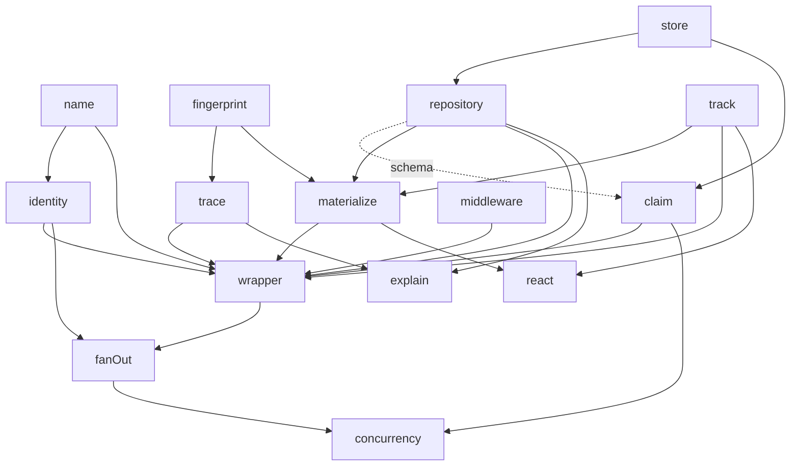

> Historical scaffold component map. The active context edges are in the [architecture specification](../spec/architecture.md) and the checked [package map](../package-map.md).

# Historical component graph — tooling fixture only

This is the frozen graph consumed by `tooling/dependencies.test.mjs` for the
existing scaffold. It is **not the target architecture or implementation plan**.
Use [the active specification](../spec/README.md) and its
[six-context architecture](../spec/architecture.md) for new work.
The full earlier narrative is [archived](../archive/pre-consolidation/source/incremental-analysis-components.md).

This fixture stays unchanged until the package-enforcement experiment and
its test-first migration replace the old checker. A passing old graph test
does not establish compliance with the target context boundaries.

