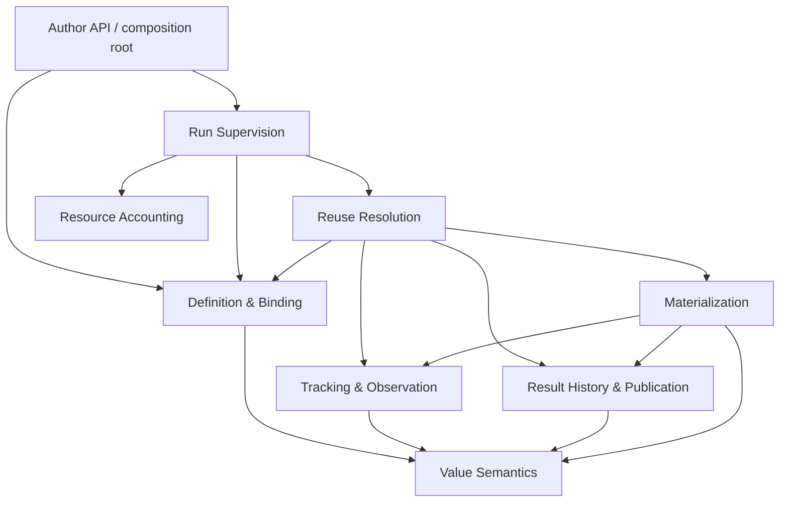

# Architecture and invariant ownership

This specification defines the accepted context boundaries. Requirements with
`ARC-` identifiers are normative. Capability names are conceptual, not finalized
TypeScript signatures. Package enforcement is specified in
[package boundaries](package-boundaries.md). No requirement here claims that the
corresponding runtime or validation tooling has already been implemented.

## ARC-001 — Six contexts, one owner per invariant

microdelta has six peer bounded contexts. Reusable Execution is an umbrella for
resolution and result lifecycle, not a seventh authority. Contexts may contain
multiple independently tested modules; a context is not permission to combine
all its behavior in one implementation.

| Context | Owned model and invariants | Contract capabilities | Outside its authority |
| --- | --- | --- | --- |
| Definition & Binding | Declared/frozen graph, templates, supplied-step slots, current declarations and binding correspondence | Construct/freeze; inspect topology; reconnect a saved binding; describe current argument bindings | Executing paid work to reconstruct a binding; cache acceptance |
| Tracking & Observation | Meaning and capture of value, presence, identity, membership, order and implementation observations; comparison with supplied current facts | Observe objects/functions; open/close capture scopes; produce and compare semantic observations | Storage, source freshness, claims, retries |
| Reuse Resolution | Current candidate acceptance, compatibility, current source policy, nested validation, consumed-content cutoff and honest misses | Resolve invocation; validate candidate; return acceptance/execution-required/failure with evidence | Direct mutation of history rows or publication authority |
| Result History & Publication | Attempts, claims, allocation, immutable snapshots, retained references/history, publication pointers and separate acceptance records | Find candidates; read exact reference; acquire/renew; publish/abandon; record acceptance | Deciding contextual freshness or whether a candidate is valid now |
| Run Supervision | Run lifetime/environment, admission, discovery closure, pending/retry/cancellation state and progress | Start/control run; admit/wait/retry/cancel; report run status | Reinterpreting cache evidence or bypassing publication fencing |
| Resource Accounting | Observed quantities, units, attribution, acknowledgment, deduplication and reporting gaps | Record/acknowledge observations; query attributed quantities | Inventing missing usage, treating estimates as observed charges |

Public contract in this document means a capability available across an approved
context boundary. It does not necessarily mean the `@public` user release tier.

## ARC-002 — Strong supporting components

**Value Semantics** owns supported value representation, canonical encoding,
structured addresses and SHA-256 content fingerprints. It decides neither which
values an execution consumed nor whether reuse is allowed. It must not become a
global collection of every context's types.

Addresses distinguish property and array-index operations using container
semantics. Numeric object keys remain JavaScript property keys: `obj[1]` and
`obj['1']` alias. An object property `Property('0')` and an array `Index(0)` may
have different structured descriptors. Neither numeric position nor array length
becomes member identity. Keyed member identities and collection projections are
separate from concrete paths. User-data symbol keys require explicit supported
semantics or rejection; symbol descriptions must not be used as identities.
Framework branding symbols do not imply support for user symbol-keyed data.

**Materialization** owns immutable value views, selected-content loading and the
bridge from accesses to observations. It uses result-reading and observation
contracts, not private rows or tracking frames. It decides neither freshness nor
candidate eligibility. Both supporting components have explicit APIs and isolated
tests and may have their own workspace packages without becoming extra contexts.

## ARC-003 — Contract dependency direction

An arrow below means consumption of a contract, not ownership of the provider's
state. The composition root installs adapters and callbacks. Reverse runtime
callbacks use injected ports rather than imports of supervisor implementations.

Execution-originated usage is submitted through an injected Accounting contract;
Accounting does not import execution implementations. Persistence adapters
implement ports owned by History or Accounting. Source/LLM adapters translate
provider behavior into declared execution and accounting contracts. Inspection
and CLI consume read/status interfaces and explicit run-control commands.
Inspection alone must never invoke computation. No consumer may bypass a port by
importing another context's private source, rows or mutable state.

## ARC-004 — Tracking remains independently usable

The unified `tracked()` object/function surface does not require a store, run,
memoized subject, or source policy. Process-local tags are implementation details.
The observation grammar belongs to Tracking; current binding correspondence
belongs to Definition & Binding; persistence encoding must preserve those
contracts without storing live tags, closures or revision clocks.

Invoking a tracked function observes its implementation fingerprint and captures
its internal tracked reads and calls. Changed observed implementation participates
in automatic invalidation; it is not merely an advisory prompt to bump a version.
Wrapping a function does not by itself memoize its result. A fingerprint is
evidence, not a restart locator. Explicit compatibility control remains available;
its detailed reconciliation is a behavioral contract, not a reason to merge these
contexts.

## ARC-005 — Definition and result graphs remain distinct

Composition fixes abstract operations, possible connections and required
precedence. Runtime creates result instances, expands frozen fanout templates and
captures actual reads. Gates may skip declared operations. Results may not create,
substitute, reconnect or reorder abstract operations. Unrelated operations need
not be serialized merely to preserve declared precedence.

Current declaration lookup must not depend on display labels, invocation ordinal
or surviving object identity. Binding reconstruction reports unavailable or
ambiguous correspondence; it does not execute paid parent work. Resolution then
produces an honest miss where safe reconstruction cannot be established.

## ARC-006 — Resolution owns current validity

A complete retained snapshot is a candidate, not proof of current validity.
Resolution consults current binding and source-policy contracts and validates
nested work hierarchically. Equal consumed child output can preserve the outer
result despite a child refresh. Tracking compares supplied facts; it does not
establish their source freshness. Current finality hooks cannot be replaced by a
stored finality flag or a previous hook answer.

## ARC-007 — Publication has one consistency owner

History owns the joint claim/allocation/publication invariant. Repository, claim
and storage modules may be separate implementations but cannot have competing
schema or transition authority. Backend atomicity must support that invariant;
the old Store's single-row CAS is not a proof of multirow publication correctness.

Completed references locate exact immutable snapshots in their proper scope.
Fresh equal content creates a distinct result; explicit reuse preserves the old
reference. Current acceptance evidence is separate from original provenance and
does not implicitly acquire publication ownership or rewind a current pointer.
Retained references must not silently become dangling or resolve to newer data.

## ARC-008 — Component evidence before assembly evidence

Each context/module must have contract tests against fakes of its ports before
relying on end-to-end tests. Required seams include:

- fresh binding catalogs with missing, renamed-label and reordered-registration
  cases;
- in-memory observation tests with no persistence dependency;
- resolution tests using fake current facts, source policies and child resolvers;
- history tests with deterministic crash boundaries and stale-holder schedules;
- supervisor tests with fake clocks, admission and execution services;
- accounting tests separating acknowledgment, duplicate delivery and unknowns;
- materialization tests proving selected loading and observation without freshness
  decisions.

Fresh-process assembly tests then verify the contracts compose. Passing them
does not replace isolated invariant tests. Tests are written before implementation
and derive expected behavior from requirements, not production internals.

## ARC-009 — Architecture model and adaptation

The accepted ownership above governs implementation. Deliberately shaped package
surfaces, encapsulation, generated declaration tiers, API Extractor reports,
compiler checks, and import-boundary checks are the selected architecture/API
contract; a parallel CML model or correspondence checker is not adopted. Those
structural checks do not substitute for behavioral tests owned by each context.

A boundary change updates its owned invariants, ports, package/API surfaces, and
contract tests together before dependent implementation. Do not create separately
maintained maps that compete with those contracts. The historical twelve-component
adjacency list is not an exception to the accepted context boundaries. See
[PKG-006](package-boundaries.md) for the superseding tooling decision.

## ARC-010 — Machine is the host boundary

`Machine` is the injected contract between microdelta runtime code and its execution
host. It is a supporting boundary, not a seventh bounded context: Definition &
Binding, Tracking & Observation, Reuse Resolution, Result History & Publication,
Run Supervision, and Resource Accounting retain the ownership in ARC-001. The
composition root supplies a Machine implementation. Contexts request only the
host capabilities their selected behavior needs; the contract grows when a
concrete requirement and a conformance case justify a new capability. A broad
catalog of hypothetical host services is not part of the initial contract.

The first implementation targets Node. Runtime modules outside the Node Machine
implementation must not import Node built-ins (with or without a `node:` prefix)
or use Node-specific globals such as `process` and `Buffer` directly. Tests,
build scripts, and tooling may use Node directly. Ordinary
ECMAScript language and standard-library features are not host capabilities by
default. When runtime behavior depends on a host facility, its meaning and
failure behavior belong in a Machine capability contract, and the Node
implementation must pass that capability's contract tests. For example, an
async-context capability must propagate host context through awaits, isolate
concurrent work, and restore a surrounding context after nested work; Tracking
continues to own capture-frame lifecycle and late-use policy. A serialization
capability must state its supported values and isolation semantics before a
`node:v8` implementation can satisfy it. This rule does not grant Machine the
History or Accounting invariants: persistence adapters still implement ports
owned by those contexts and may consume Machine capabilities behind those ports.

The current scaffold imports `node:async_hooks` for `AsyncLocalStorage` and
`node:v8` for memory-store serialization directly in runtime source. Those are
known baseline dependencies to isolate when the affected code is brought across
the boundary; the scaffold does not already conform. A durable filesystem is
not mandatory for Machine or its initial Node implementation. The selected
History backend defines its actual persistence needs through its port and
adapter. Browser, Lambda, and Worker implementations are outside the current
delivery sequence; no capability may be added solely to simulate them.

**Validation:** a source-level check rejects direct Node built-in imports and
Node-specific global use in runtime modules outside the Node Machine
implementation, with an explicit test/tooling exception. Each introduced
capability has outcome-first contract tests run against the Node implementation,
including an unsupported/failure case where the capability can fail. Integration
tests prove the consuming context receives the implementation through injection,
without transferring its invariant ownership to Machine. See
[A-20](acceptance.md) and the [foundation gate](../milestones.md).
